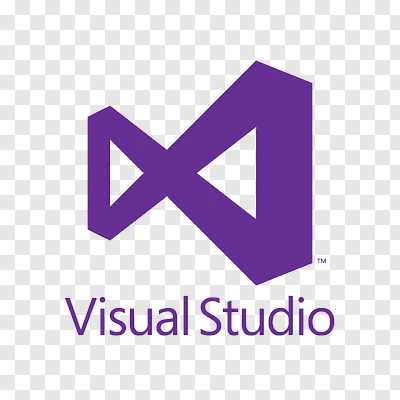

<h1 style="text-align: center; font-size: 2.5rem; margin-bottom: 1rem;">
NovaCode
</h1>


## Table of Contents

- [Description](#description)
- [Getting Started](#getting-started)
  - [Installing](#installing)
  - [Executing program](#executing-program)
- [Technologies Used](#technologies-used)
- [Authors](#authors)
- [Help](#help)

## Description

NovaCode is a team creating small, simple, entertaining and relaxing games.

## Getting Started

### Installing

* Download or clone the repository:
```
git clone https://github.com/codingburgas/sprint-math-games-9th-grade-novacode.git
```
### Executing program

* Type .\main.exe in your cmd to open the game!

## Technologies Used

<p align="center">



</p>

## Authors

Contributors names and contact info

- Angel Friederich (Scrum Trainer) - APFriedirich24@codingburgas.bg
- Dimitar Yanakiev (FrontEnd Developer) - DVYanakiev24@codingburgas.bg
- Georgi Hristov (Backend Developer) - VHGeorgiev24@codingburgas.bg
- Viktor Geogriev (Designer) - 24@codingburgas.bg
